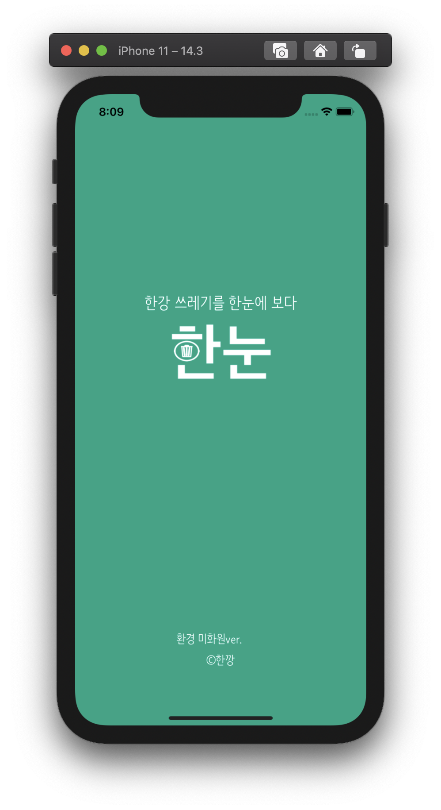
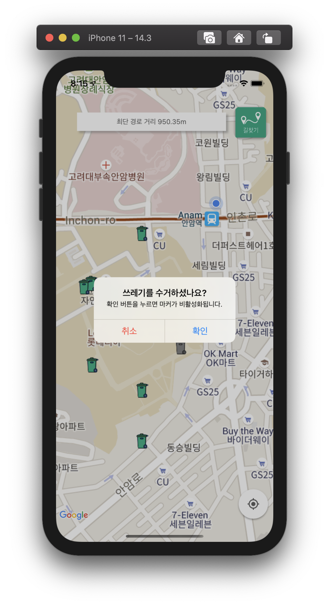
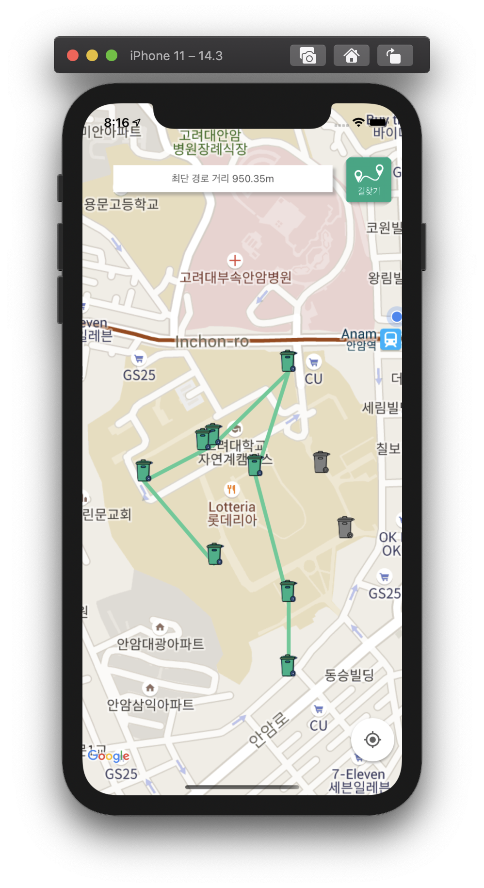

# ios-ccp-map

## <한강 쓰레기 한눈에보다 : 한눈>
- 2020-2 cpp 프로젝트 (팀명: 한깡)
- 드론팀이 영상 인식한 쓰레기 데이터를 받아와 지도에 표시해주는 어플리케이션
- 환경미화원분들의 한강 쓰레기 수거 문제를 해결하고자 기획함
- 마커 표시, 수거 기능, 최단거리 경로 조회기능, 최단거리 표시
- Google Map iOS SDK 사용xq
- Google Firebase 실시간 데이터베이스 사용


### 작업 환경
- Xcode 12, pod version 1.10, swift 5
- `pod install` 후 workspace 실행
- DS.store 충돌 사례:
```
  find . -name .DS_Store -print0 | xargs -0 git rm -f --ignore-unmatch
```
- 빌드 버전 충돌 사례:
    - cocoapods version 1.10 이상 확인
    - build target 버전 확인 
- bundle id 일치 확인: com.ccp.map

### 화면
<div style="display:flex; flex-direction:row">
  
  
  
</div>
